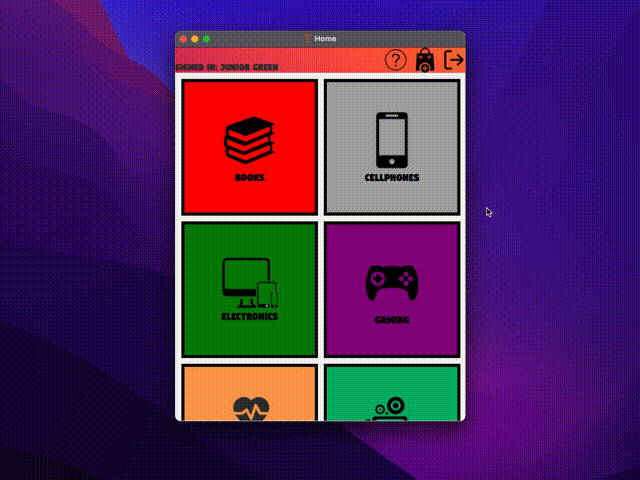

# E-Catalog-Shopping-Interface
Mock concept for online shopping user interface. Uses text files as to store a small database of account user information and credentials for login verifications. Features multiple shopping categories and products for purchase and has a cart screen to display all products ready for checkout. Takes in payment information and saves an invoice in the form of a .doc file in the specified directory location on computer.

# Contributors

Junior Green<<juniorgreen@cmail.carleton.ca>>

# Installation/Notes

Download and install Eclipse IDE

Download zipped clone from repository, extract, and open as new eclipse project

Please refer to this youtube video for instructions on the installation/implementation of JavaFX for the Eclipse IDE (https://www.youtube.com/watch?v=bk28ytggz7E&t=317s)

# Gallery
**Login screen**

**Account creation**

**Login with credentials**

**Catalog and Products**

**Adding products to cart**

**Cart**

**Checkout**

